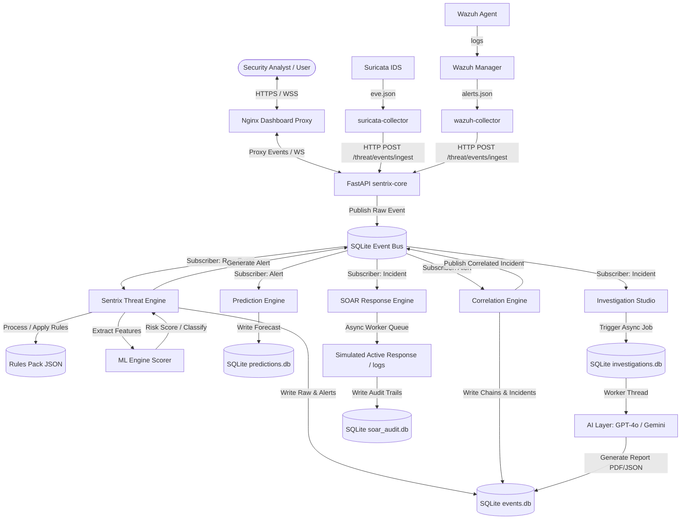

# Sentrix V10 — Architecture and Data Flow

This document details the software architecture, runtime dependencies, and end-to-end data pipeline flow of the Sentrix platform.

---

## 1. High-Level Architecture Diagram

---

## 2. End-to-End Pipeline & Data Flows

### Flow A: Log Ingestion & Threat Detection (Raw -> Alert)
1. **Generation**:
   - Traffic passing through the target container `dvwa` triggers security rules in `Suricata`.
   - Host level events (process spawning, registry updates) are recorded by Sysmon or Wazuh agents and sent to the `Wazuh Manager`.
2. **Collection**:
   - `suricata-collector` tails `/var/log/suricata/eve.json`.
   - `wazuh-collector` tails `/var/ossec/logs/alerts/alerts.json`.
   - The collectors parse raw logs and format them into an ingestion payload containing a `X-API-Key` header.
3. **Ingestion**:
   - Collectors POST the parsed payload to FastAPI at `/api/v1/threat/events/ingest`.
   - FastAPI Normalizer maps the raw log dynamically to a `CanonicalEvent` pydantic model schema and stores it in the `raw_events` database.
4. **Publishing**:
   - The normalised `CanonicalEvent` is serialized and published to the in-process SQLite message queue on the `events.raw` topic.
5. **Processing**:
   - The `SentrixThreatEngine` subscriber thread receives the message.
   - It runs the event through the active threat rules pack.
   - The engine extracts 26 telemetry features and queries the `MLEngine` risk model for inference.
   - If a rule condition matches or ML risk passes thresholds, a new threat `Alert` is generated and published back to the bus on the `events.alerts` topic. It is also persisted in the central `events.db` `alerts` table.

### Flow B: Correlation, Forecasting & Remediation (Alert -> Incident -> Response)
1. **Correlation**:
   - The `CorrelationEngine` subscriber thread consumes the new `Alert` from the `events.alerts` topic.
   - It matches the alert against active buckets using correlation keys (`source_ip`, `hostname`, `username`, `hash`).
   - If the alert count >= 3 or different telemetry sources (Suricata + Wazuh) appear in the bucket within a 5-minute sliding window, the bucket is promoted to a **Correlated Incident**.
   - The promoted incident is saved to `events.db` and published to `incidents.correlated`.
2. **Forecasting**:
   - The `PredictionEngine` subscriber thread consumes the new `Alert` from `events.alerts`.
   - It updates the attacker's `AttackPath` and feeds it through Markov chains and campaign classifiers to predict the attacker's next move and overall compromise probability.
   - The prediction forecast is stored in `predictions.db`.
3. **Investigation & SOAR**:
   - The `InvestigationStudioEngine` subscriber thread consumes the promoted incident from `incidents.correlated` and adds it to the background job queue.
   - An asynchronous worker thread pulls the job, aggregates related alerts, queries the AI layer (GPT-4o or Gemini) for threat narratives and remediation advice, and writes the report to `investigations.db`.
   - Concurrently, the `SOAREngine` subscriber thread consumes the incident and triggers playbooks (e.g. `block_attacker` or `notify_soc`). Actions are logged to `soar_audit.db`.

### Flow C: Dashboard UI Updates
1. **Polled Updates**:
   - The dashboard frontend polls REST API endpoints (`/api/v1/dashboard/top-attackers`, `/api/v1/dashboard/predictions`, etc.) every 10 seconds to fetch and render aggregate widgets.
2. **Real-time Broadcast**:
   - When users open the Overview screen, a WebSocket connection is established to `/ws/live`.
   - The FastAPI broadcaster thread watches the SQLite event bus and database. As new events, alerts, or metrics occur, they are instantly pushed as JSON frames to the browser, updating charts and feed tables in real-time.

---

## 3. Critical Runtime Dependencies

- **SQLite Databases**: Must be writable by the backend application process. Under Docker, the volume `/data` must have correct read/write permissions.
- **FastAPI / Uvicorn**: Runs as a single process. Internal engines (Threat, Prediction, Correlation, SOAR, Investigation) execute as **background daemon threads** within the same python memory space, sharing state.
- **Network Bridges**:
  - `dvwa-net`: Connects `dvwa` and `dvwa-db`.
  - `sentrix-net`: Connects `sentrix-core`, Nginx dashboard, and collectors.
  - Suricata runs in `host` or `service:dvwa` mode to capture its raw network packets.
- **AI Keys**: `OPENAI_API_KEY` and `GEMINI_API_KEY` environment variables. If missing, the AI layer falls back gracefully to a Dummy provider, using pre-configured mock templates.
