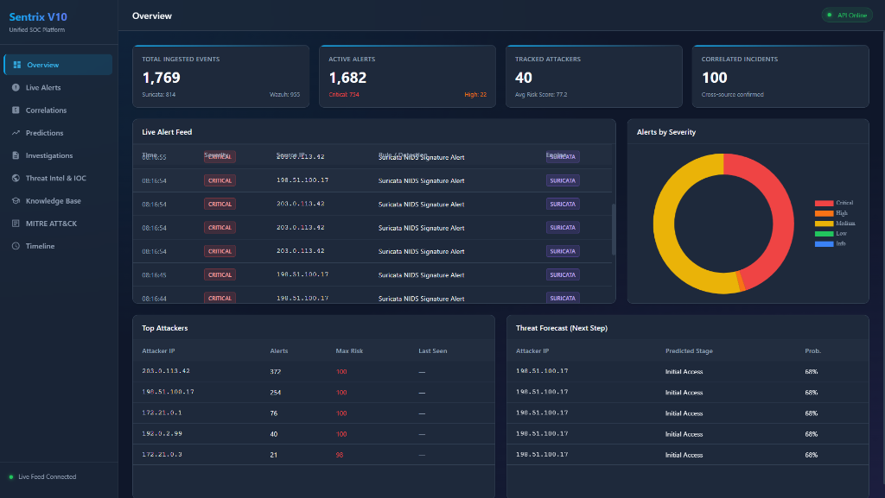
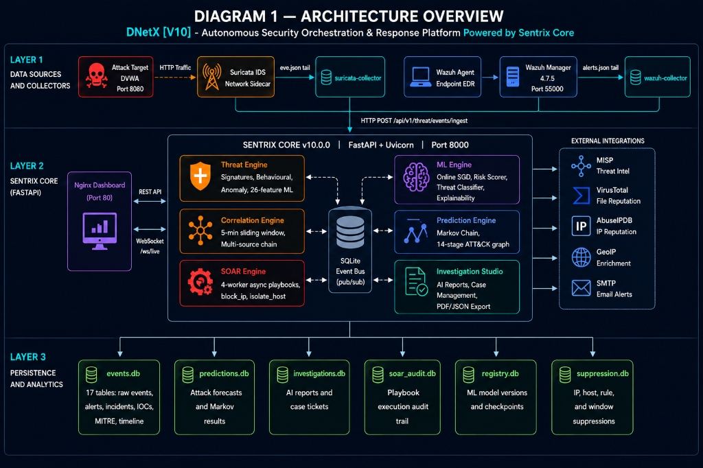
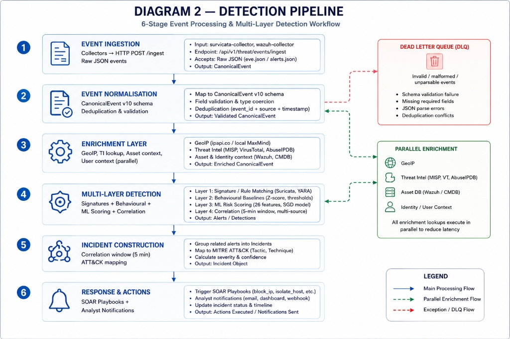
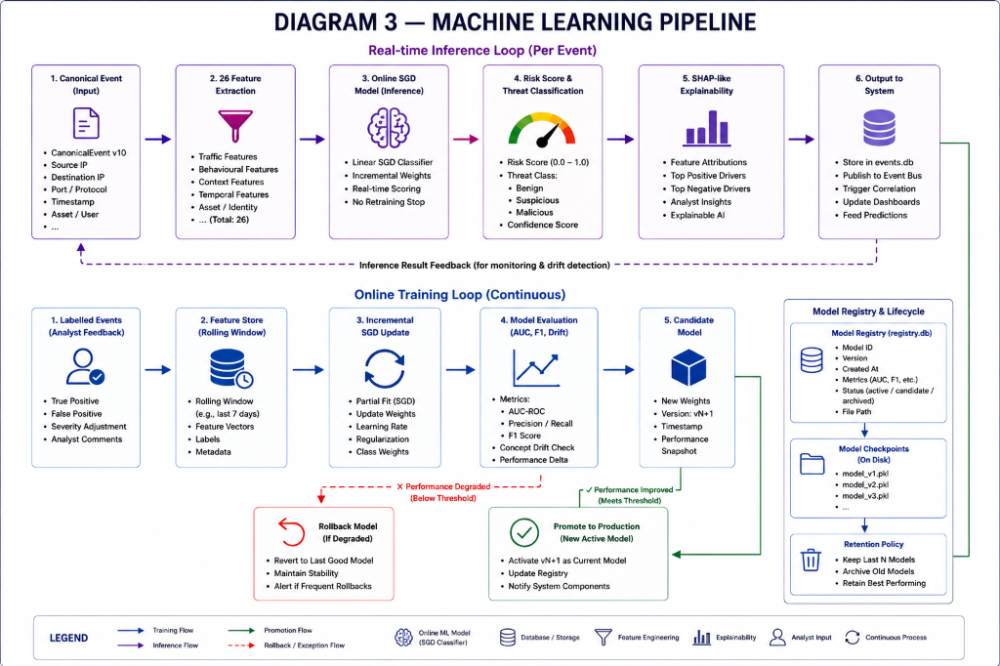
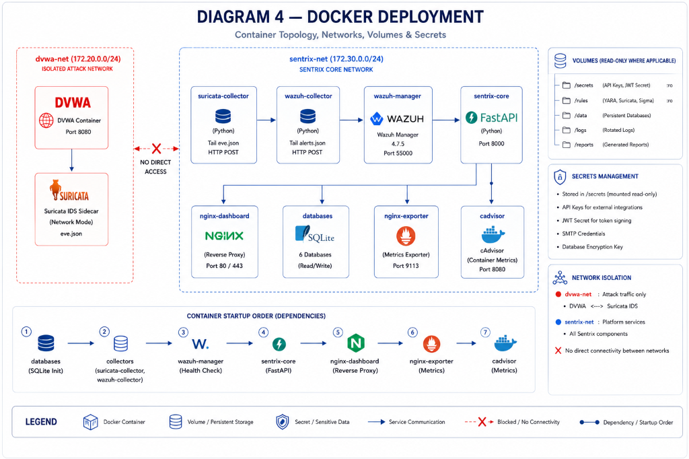
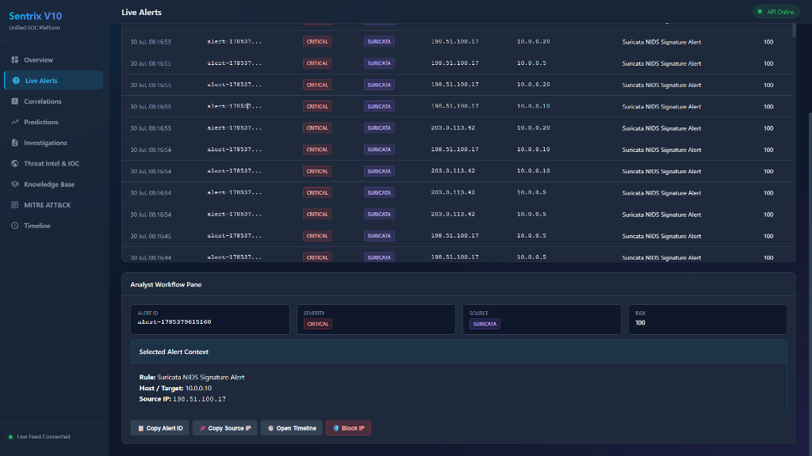
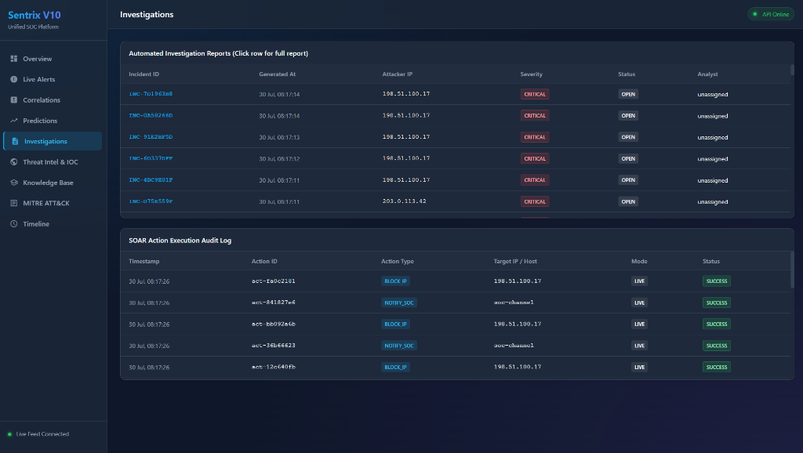
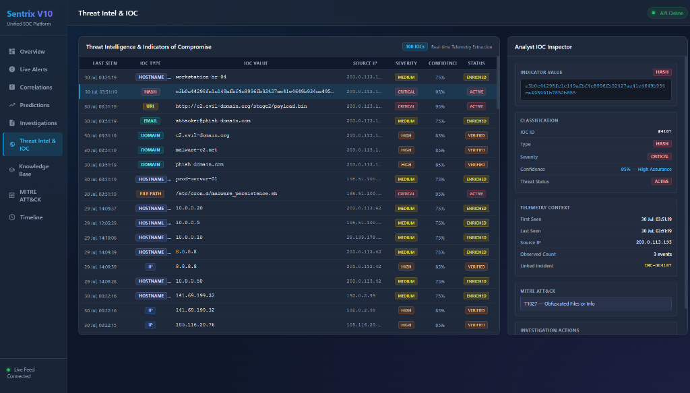
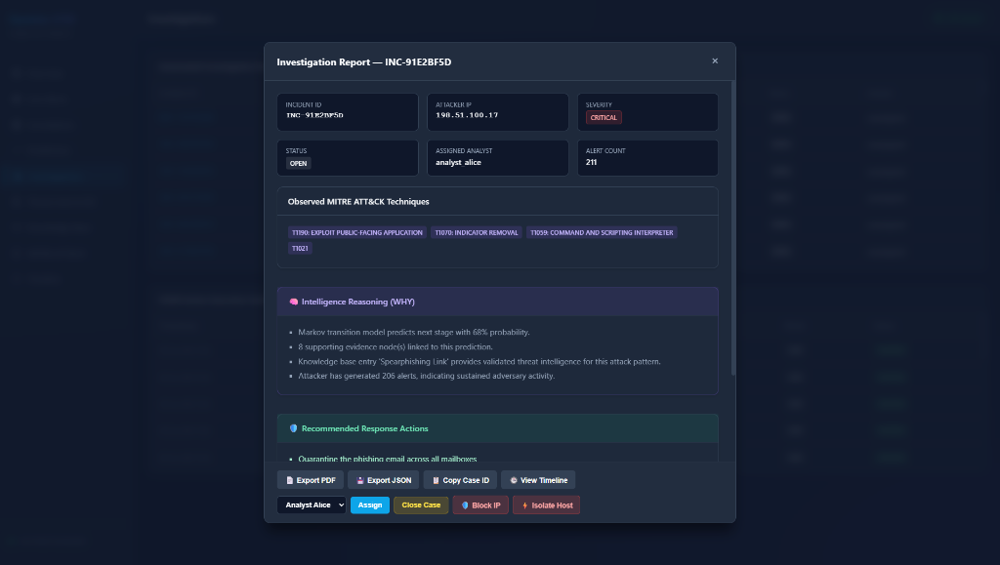

# DNetX [V10]

## Autonomous Security Orchestration & Response Platform

> **DNetX [V10]** is an autonomous Security Orchestration & Response (SOAR) platform engineered to unify threat detection, telemetry correlation, automated investigation, and response orchestration across modern security infrastructures. Powered by Sentrix Core, DNetX integrates multiple security data sources, behavioral analytics, machine learning, and intelligent response workflows into a centralized operational environment for real-time cyber defense.

[](https://www.python.org/)
[](https://fastapi.tiangolo.com/)
[](https://docs.docker.com/compose/)
[](https://suricata.io/)
[](https://wazuh.com/)
[](https://attack.mitre.org/)
[](LICENSE)
[](#testing)
[](https://15arghya2004.github.io/DfNetX-Core-ShowCase-/)

> ### 🌐 [**Check out the live showcase website →**](https://15arghya2004.github.io/DfNetX-Core-ShowCase-/)
> A dedicated site with an interactive walkthrough of DNetX's key benefits. Source lives in [`website/`](website/).

### Platform Overview Dashboard

<p align="center">
  
</p>

## Key Highlights

- **Autonomous SOAR Platform** — Automated response playbooks (`block_ip`, `isolate_host`, `notify_analyst`) with simulation mode and persistent audit logging
- **Multi-source Threat Correlation** — Real-time telemetry correlation across network IDS (Suricata), endpoint EDR (Wazuh), Sysmon, Zeek, and generic SIEM sources
- **Signature + Behaviour + ML Detection** — Multi-layered detection pipeline combining signature rules, behavioural baselines, statistical anomaly scoring, and ML risk regression
- **Online Machine Learning** — Embedded MLOps pipeline using online Stochastic Gradient Descent (SGD) with real-time model retraining from analyst feedback
- **MITRE ATT&CK Mapping** — Automatic technique, tactic, and kill-chain stage annotation for every alert and correlated incident
- **Explainable AI** — Linear SHAP-like feature attributions providing top-3 risk drivers for transparent analyst triage
- **Investigation Automation** — AI-generated threat narratives, attack timelines, and remediation recommendations via GPT-4o or Gemini 1.5 Flash
- **Docker-based Deployment** — 8-container microservice topology deployable with a single `docker compose up` command
- **REST + WebSocket APIs** — Comprehensive REST API (40+ endpoints) with 3-tier RBAC and a 2-second real-time WebSocket live stream
- **Real-time Dashboard** — Interactive browser SPA with chart widgets, alert feeds, investigation studio, and MITRE ATT&CK heatmap

---

## Table of Contents

- [Overview](#overview)
- [Platform Architecture](#platform-architecture)
- [Detection Pipeline](#detection-pipeline)
- [Machine Learning Pipeline](#machine-learning-pipeline)
- [Docker Deployment](#docker-deployment)
- [Dashboard Gallery](#dashboard-gallery)
- [Feature Matrix](#feature-matrix)
- [Technology Stack](#technology-stack)
- [Directory Structure](#directory-structure)
- [Quick Start](#quick-start)
- [Installation](#installation)
- [Configuration](#configuration)
- [API Overview](#api-overview)
- [Security Model](#security-model)
- [Performance](#performance)
- [Testing](#testing)
- [Roadmap](#roadmap)
- [Contributing](#contributing)
- [License](#license)
- [Acknowledgements](#acknowledgements)

---

## Overview

### The Problem

Modern Security Operations Centers (SOCs) face a critical tooling paradox. Enterprise-grade SIEM and XDR platforms (Splunk, Elastic Security, Microsoft Sentinel, CrowdStrike) are expensive and opaque. Open-source alternatives — Suricata, Wazuh, MISP — exist as **disconnected islands**. Security analysts manually correlate events across multiple dashboards, triage thousands of low-quality alerts, and write investigation reports by hand. This produces:

- **Alert fatigue** — thousands of uncorrelated alerts without prioritised incident views
- **MTTD measured in days**, not minutes
- **Zero predictive capability** — no forecasting of attacker next-steps
- **Manual investigation bottleneck** — analysts create reports from raw logs
- **No closed-loop learning** — detection models never improve from analyst feedback

### The DNetX Solution

DNetX is the **unifying intelligence layer** above raw detection tools:

1. **Ingests, normalises, and correlates** events from all sources into a unified `CanonicalEvent` schema
2. **Applies multi-layered detection** — signatures, behavioural baselines, ML scoring, and chain correlation simultaneously
3. **Predicts attacker next-steps** via a Markov-chain model over a 14-stage MITRE ATT&CK kill-chain graph
4. **Auto-generates investigation reports** via GPT-4o or Gemini 1.5 Flash
5. **Dispatches SOAR playbooks** (block IP, isolate host, notify SOC) on correlated incidents
6. **Closes the learning loop** — analyst feedback trains the ML engine in real-time

---

## Platform Architecture

DNetX employs a high-throughput, event-driven architecture designed to process, enrich, and correlate security events in real-time. Built around an internal SQLite-backed pub/sub messaging bus, the core engine orchestrates ingestion, multi-layered threat detection, online machine learning, attack path forecasting, and automated response within a unified operational environment.

<p align="center">
  
</p>

DNetX is an **event-driven microservice mesh** orchestrated by Docker Compose. Core intelligence runs inside a single Python process (`sentrix-core`) as concurrent background threads communicating through an internal SQLite pub/sub event bus — no external broker required.

### Internal Event Bus Topics

| Topic | Publisher | Subscribers |
|---|---|---|
| `events.raw` | Ingestion route | Threat Engine |
| `events.alerts` | Threat Engine | Correlation Engine, Prediction Engine |
| `incidents.correlated` | Correlation Engine | Investigation Studio, SOAR Engine, ML Engine |
| `soar.trigger` | SOAR Engine | SOAR Worker pool (4 threads) |

---

## Detection Pipeline

Events entering DNetX progress through a rigid 6-stage lifecycle — from raw telemetry ingestion and schema validation to normalisation, enrichment, multi-layered detection, and automated alert publication. High-volume alerts are correlated within sliding time windows to construct actionable incident graphs.

<p align="center">
  
</p>

Every inbound event is processed through six sequential stages within the `SentrixThreatEngine`:

```
STAGE 1 - RAW INGEST
  Collector POSTs raw log to /api/v1/threat/events/ingest
  Source type auto-detected (suricata | wazuh | generic)
  Collector health heartbeat updated in events.db

STAGE 2 - SCHEMA VALIDATION
  TelemetryValidator checks required fields and types
  Invalid events routed to Dead Letter Queue (DLQ)
  Audit log entry written for every rejected event

STAGE 3 - CANONICAL NORMALISATION
  Source-specific plugin normalises to CanonicalEvent Pydantic schema
  Supported sources: Wazuh, Suricata, Sysmon, Zeek, Generic SIEM
  All 17 typed fields populated (source, destination, user, process, etc.)

STAGE 4 - ENRICHMENT
  MITRE technique ID mapped to tactic and kill-chain stage
  Threat intel connectors queried (AbuseIPDB, VirusTotal, GeoIP, Shodan)
  IOC repository cross-referenced for known malicious indicators

STAGE 5 - THREAT DETECTION
  Suppression check (IP whitelist / maintenance window)
  Signature rule evaluation (equals, contains, greater_than, regex, sequence)
  Behavioural detector evaluates baseline deviation
  Anomaly detector scores statistical outliers
  ML Engine: 26-feature extraction -> risk score + threat category + explainability
  Threshold engine: time-windowed count-based alert correlation
  Sequence engine: ordered event sequence matching
  Attack chain engine: multi-source incident correlation

STAGE 6 - ALERT GENERATION AND PUBLICATION
  Alert written to events.db alerts table
  Alert published to EventBus on events.alerts topic
  Subscribers triggered: PredictionEngine, CorrelationEngine
```

### Correlation and Incident Promotion

The `CorrelationEngine` promotes alert buckets to correlated incidents when:
- Alert count >= 3 from the same source IP within a 5-minute sliding window, or
- Suricata + Wazuh alerts from the same attacker appear in the same bucket (multi-source correlation)

Promoted incidents trigger: ML Engine enrichment, AI Investigation Studio, and SOAR Engine.

---

## Machine Learning Pipeline

DNetX incorporates a continuous, embedded MLOps pipeline featuring real-time risk scoring, threat category classification, and online model updating. By leveraging real-time Stochastic Gradient Descent (SGD) and analyst feedback at incident resolution, detection models dynamically adapt to new threat vectors with automated drift monitoring and checkpoint rollback capabilities.

<p align="center">
  
</p>

DNetX implements an embedded MLOps pipeline with online learning. No batch jobs, no data lake, no external MLflow server required.

### Feature Engineering (26 Features)

```
Severity Features   : severity_score (normalised 0.0-1.0)
Protocol Features   : is_tcp, is_udp, is_icmp, is_http (one-hot encoded)
Network Features    : src_port_normalized, dst_port_normalized
Asset Features      : asset_criticality (from enrichment metadata)
Historical Features : historical_alert_count, average_historical_risk
Reputation Features : reputation_score (from AbuseIPDB / VirusTotal)
MITRE Tactic Flags  : tactic_Reconnaissance ... tactic_Impact (14 binary flags)
```

### Model Architecture

| Model | Algorithm | Output |
|---|---|---|
| Risk Scorer | Online Ridge SGD Regression | Risk score 0-100 |
| Threat Classifier | Online Logistic SGD Multiclass | Threat category label |
| Anomaly Detector | Online statistical streaming detector | Anomaly score |
| Attack Predictor | Markov chain transition model | Next kill-chain stage |

### MLOps Lifecycle

```
Model bootstrapped at v1.0.0 on first startup
         |
         v
Live events -> Feature extraction -> Inference -> Results to UI + explainability
         |
         v
Analyst closes incident -> Labeled sample submitted to learning queue
         |
         v
OnlineLearningWorker (background thread) dequeues sample
         |
         +-- Clone active model state (serialised deep copy)
         +-- Apply SGD weight update (train_step)
         +-- Evaluate on validation cache (last 200 samples)
         +-- If accuracy improves: promote candidate, write checkpoint
         +-- If accuracy drops:    rollback to previous checkpoint
```

All versions registered in `registry.db` with algorithm, feature schema hash, accuracy metrics, checkpoint path, deployment state, and promotion audit trail.

---

## Docker Deployment

The platform is containerized using Docker Compose into an 8-service topology designed for modular isolation and security. Target attack environments and vulnerability scanners operate on dedicated bridge networks with strict communication boundaries, protecting internal platform services while ensuring seamless telemetry collection.

<p align="center">
  
</p>

### Container Topology

| Container | Image | Purpose | Port |
|---|---|---|---|
| `sentrix-dvwa-db` | `mysql:5.7` | DVWA database (isolated network) | internal |
| `sentrix-dvwa` | `ghcr.io/digininja/dvwa:latest` | Vulnerable web attack target | 8080 |
| `sentrix-suricata` | `jasonish/suricata:latest` | Passive IDS sidecar on DVWA namespace | — |
| `sentrix-wazuh` | `wazuh/wazuh-manager:4.7.5` | EDR event aggregation | 55000 |
| `sentrix-core` | `sentrix-core:v10` | FastAPI SOC intelligence platform | 8000 |
| `sentrix-suricata-collector` | `sentrix-core:v10` | Tails eve.json and forwards to core | — |
| `sentrix-wazuh-collector` | `sentrix-core:v10` | Tails alerts.json and forwards to core | — |
| `sentrix-dashboard` | `nginx:alpine` | Dashboard UI and API reverse proxy | 80 |

### Network Segmentation

```
dvwa-net    (172.21.0.0/16)  -- DVWA app and MySQL (isolated from SOC)
sentrix-net (172.20.0.0/16)  -- Core, collectors, Wazuh, Nginx
```

Suricata shares the DVWA network namespace (`network_mode: service:dvwa`) to capture all target traffic without requiring host network mode.

### Memory Limits

| Container | Limit |
|---|---|
| `sentrix-core` | 2 GB |
| `sentrix-wazuh` | 1 GB |
| `sentrix-dvwa-db` | 512 MB |
| All collectors and dashboard | 256 MB each |

### Secrets Management

Credentials are mounted at container runtime from `secrets/` via Docker Compose Secrets into `/run/secrets/` inside each container. No secrets appear in environment variable definitions, Dockerfile layers, or image build history.

```bash
docker compose ps                         # View container status
docker compose logs -f sentrix-core      # Follow core engine logs
docker compose down -v                   # Stop and remove volumes
```

### Scaffolded Extensions

The compose file includes ready-to-uncomment definitions for: Prometheus, Grafana, Elasticsearch, Kibana, and Zeek.

---

## Dashboard Gallery

<p align="center">
  
  
</p>

<p align="center">
  
  
</p>

---

## Feature Matrix

### Core Detection Engine

| Feature | Description |
|---|---|
| Multi-Source Ingestion | Unified HTTP ingest for Suricata, Wazuh, Sysmon, Zeek, and generic SIEM payloads |
| Canonical Normalisation | Plugin-based normaliser maps all sources to a typed `CanonicalEvent` Pydantic schema |
| Schema Validation + DLQ | Inbound telemetry validation with Dead Letter Queue for rejected events |
| Signature-Based Detection | JSON rule definitions with field matching, threshold conditions, and sequence patterns |
| Behavioural Detection | Statistical baseline deviation detection across source IP behaviour profiles |
| Anomaly Detection | Streaming statistical anomaly scoring for unusual network telemetry |
| Attack Chain Correlation | Multi-source alert correlation within 5-minute sliding windows |
| MITRE ATT&CK Mapping | Automatic technique annotation for every alert (T-ID -> Tactic -> Stage) |
| IOC Repository | IP, domain, hash IOC database with real-time enrichment lookups |
| Alert Suppression | IP/CIDR whitelist, host suppression, rule suppression, and maintenance windows |
| Rule Hot Reload | Zero-downtime rule reload via watchdog filesystem watcher |
| Crisis Mode | Elevated detection sensitivity mode for active incident response |

### Machine Learning Engine

| Feature | Description |
|---|---|
| 26-Feature Pipeline | Severity, protocol, ports, asset criticality, historical context, MITRE tactic flags |
| Online Risk Scorer | Ridge SGD regression — 0-100 risk scores, updating from analyst feedback |
| Threat Classifier | Online Logistic SGD multiclass classifier for threat category labelling |
| Anomaly Detector | Online streaming anomaly detector with configurable sensitivity |
| Drift Detection | PSI-based model drift monitor with automatic rollback trigger |
| Versioned Model Registry | SQLite registry with candidate/active/retired lifecycle states |
| Atomic Checkpointing | Serialised checkpoint writes with feature schema version hashing |
| Analyst Feedback Loop | Incident resolution triggers labelled SGD weight update |
| Explainability | Linear SHAP-like attribution — top-3 contributing features returned to UI |
| Attack Predictor | Online Markov transition predictor for kill-chain stage forecasting |

### Prediction Engine

| Feature | Description |
|---|---|
| 14-Stage Attack Graph | Full MITRE ATT&CK kill-chain directed transition graph |
| Markov Chain Forecasting | Probabilistic next-stage prediction from attacker's current position |
| Attack Path Tracking | Per-attacker IP registry tracking all observed kill-chain stages |
| Campaign Classification | Heuristic classifier mapping multi-stage activity to campaign archetypes |
| Compromise Probability | Composite compromise probability score per active attacker |

### Investigation and Response

| Feature | Description |
|---|---|
| AI Investigation Reports | Threat narrative, attack timeline, and remediation recommendations (GPT-4o or Gemini) |
| PDF and JSON Export | ReportLab PDF export and structured JSON investigation report output |
| Case Management | Full CRUD ticket lifecycle (open -> in-progress -> resolved) with analyst assignment |
| Evidence Graph | SQLite-backed evidence relationship graph linking alerts to incidents |
| SOAR Engine | 4-worker async playbook queue: `block_ip`, `isolate_host`, `notify_analyst` |
| Simulation Mode | SOAR actions default to simulation — prevents accidental live network changes |
| Full Audit Trail | Every SOAR action logged with timestamp, target, status, and mode |

### Platform and Observability

| Feature | Description |
|---|---|
| Real-Time Dashboard | Browser-based SOC dashboard with chart widgets, alert feed, and MITRE heatmap |
| WebSocket Live Feed | `/ws/live` pushes events, alerts, and KPIs every 2 seconds to connected browsers |
| Connector Framework | Plugin architecture for AbuseIPDB, VirusTotal, Shodan, GeoIP, and custom feeds |
| Rule Studio API | REST CRUD for custom detection rules with test-fire capability |
| Pipeline Trace | `/api/v1/trace/{event_id}` returns full lifecycle trace of any event |
| Security Knowledge Base | Built-in playbooks, MITRE tactic index, severity classifiers, and recommendations |
| Metrics Endpoint | `/metrics` returns live rule latency, invalid event count, and connector health |

---

## Technology Stack

### Backend

| Component | Technology | Purpose |
|---|---|---|
| API Framework | FastAPI 0.111 + Uvicorn 0.30 | Async HTTP and WebSocket server |
| Data Models | Pydantic v2 + Pydantic-Settings | Typed schemas and environment configuration |
| Authentication | python-jose (JWT HS256) + API Key | Dual-mode auth with 3-tier RBAC |
| PDF Reports | ReportLab 4.2 | Investigation report PDF generation |
| Persistence | SQLite (WAL mode, 30s busy-timeout) | All 6 platform databases |
| ML and Numerics | NumPy >= 1.26 | Online SGD weight vectors and feature arrays |
| File Watch | Watchdog 4.0 | Rule hot-reload filesystem event monitoring |
| HTTP Client | Requests 2.32 | Threat intel enrichment API calls |
| YAML | PyYAML 6.0 | Suricata configuration and knowledge base data |

### AI Integration

| Provider | Model | Activation |
|---|---|---|
| OpenAI | GPT-4o (temperature 0.3) | Set `OPENAI_API_KEY` |
| Google | Gemini 1.5 Flash | Set `GEMINI_API_KEY` |
| Dummy | Template-based mock | Auto-activated when no AI keys present |

The platform is fully operational without AI keys. All detection, ML scoring, and SOAR features are unaffected by AI provider availability.

### Infrastructure

| Component | Technology | Purpose |
|---|---|---|
| Container Runtime | Docker + Docker Compose v2 | 8-service orchestration |
| IDS | Suricata (jasonish/suricata:latest) | Network packet inspection |
| EDR | Wazuh Manager 4.7.5 | Endpoint detection and response |
| Attack Target | DVWA (ghcr.io/digininja/dvwa) | Realistic vulnerable web application |
| Frontend Server | Nginx Alpine | Static asset serving and API reverse proxy |
| DVWA Database | MySQL 5.7 | Isolated DVWA application database |
| Secrets | Docker Compose Secrets (file-backed) | API keys, JWT secrets, database passwords |

---

## Directory Structure

```
DfNetX-Core/
|
+-- main.py                       <- FastAPI entrypoint and engine lifecycle
+-- docker-compose.yml            <- 8-container orchestration definition
+-- Dockerfile                    <- Python 3.14-slim container image
+-- requirements.txt              <- Pinned production dependencies
+-- .env.example                  <- Environment variable template
|
+-- dashboard/                    <- Frontend served by Nginx
|   +-- index.html                <- Full-featured SOC dashboard SPA
|   +-- nginx.conf                <- API and WebSocket reverse proxy config
|
+-- suricata/                     <- Network IDS configuration
|   +-- suricata.yaml             <- Suricata sniffer configuration
|   +-- rules/
|       +-- 01_local.rules        <- Custom local signatures
|       +-- 02_web.rules          <- HTTP vulnerability detection
|       +-- 03_recon.rules        <- Port scan detection
|       +-- 04_exploit.rules      <- RCE and injection signatures
|       +-- 05_malware.rules      <- Malware payload patterns
|       +-- 06_bruteforce.rules   <- SSH/FTP credential stuffing
|       +-- 07_dns.rules          <- DNS tunneling detection
|       +-- 08_tls.rules          <- TLS handshake anomalies
|       +-- 09_protocol.rules     <- Protocol abuse detection
|       +-- 10_c2.rules           <- Command and Control beacon signatures
|
+-- validation/                   <- Integration and validation tests
|   +-- test_sentrix_v8.py        <- 22-test core validation suite
|   +-- test_e2e_pipeline.py      <- End-to-end ingest to incident test
|   +-- test_sentrix_v7.py        <- Live endpoint regression tests
|   +-- test_soar_engine.py       <- SOAR playbook audit tests
|   +-- test_queue_retry.py       <- DLQ and retry logic tests
|   +-- test_correlation_persist.py <- Correlation chain DB persistence
|   +-- test_asset_context.py     <- Asset risk profiling tests
|
+-- scripts/
|   +-- generate_certs.py         <- TLS certificate generation utility
|   +-- inspect_db.py             <- Database inspection helper
|
+-- sentrix_core/                 <- Core platform Python package
    +-- ai_layer/                 <- AI provider factory (GPT-4o/Gemini/Dummy)
    +-- api/                      <- FastAPI route handlers (14 routers)
    +-- case_management/          <- Ticket CRUD and lifecycle management
    +-- collectors/               <- Suricata and Wazuh log tail agents
    +-- config/                   <- Centralised pydantic-settings configuration
    +-- connector_framework/      <- Plugin framework plus 8 enrichment connectors
    +-- enrichment/               <- MITRE mapping and threat intel enricher
    +-- event_bus/                <- SQLite pub/sub broker and DLQ worker
    +-- investigation_engine/     <- AI report builder, job queue, case exporter
    +-- knowledge/                <- Security knowledge base (playbooks, MITRE)
    +-- metrics/                  <- Latency and count telemetry collector
    +-- ml_engine/                <- Full MLOps pipeline (25 modules)
    +-- normalization/            <- Multi-source canonical normalisation plugins
    +-- prediction_engine/        <- Markov attack path and campaign classifier
    +-- prediction_intelligence/  <- Knowledge-enriched prediction layer
    +-- reporting/                <- PDF and JSON report renderer
    +-- response_engine/          <- SOAR playbook engine (4-worker async)
    +-- rule_define_studio/       <- Rule CRUD, default pack, hot-reload watcher
    +-- security/                 <- JWT auth, API key auth, RBAC
    +-- storage/                  <- EventStore (central SQLite helper, 17 tables)
    +-- suppression/              <- Alert suppression (IP, host, rule, window)
    +-- threat_engine/            <- Primary detection orchestrator (15 sub-modules)
    +-- threat_intel/             <- IOC repository
```

---

## Quick Start

### Prerequisites

- Docker >= 24.0 and Docker Compose v2
- 4 GB RAM minimum (8 GB recommended)
- Ports 80, 8000, 8080, and 55000 available

### 1. Clone and Configure

```bash
git clone https://github.com/15Arghya2004/DfNetX-Core-ShowCase-.git
cd DfNetX-Core-ShowCase-
cp .env.example .env
```

### 2. Create Secrets

```bash
mkdir -p secrets
echo "your-strong-api-key-here"  > secrets/sentrix_api_key.txt
echo "your-jwt-secret-32chars+"  > secrets/jwt_secret_key.txt
echo "rootpassword"              > secrets/db_root_password.txt
echo "dvwapassword"              > secrets/db_password.txt
echo "wazuh-api-password"       > secrets/wazuh_api_password.txt
```

### 3. Launch the Platform

```bash
docker compose up -d
```

All 8 containers start. Allow approximately 60 seconds for Wazuh to initialise.

### 4. Open the Dashboard

Navigate to **http://localhost** — the SOC dashboard displays live event feeds, alert tables, MITRE heatmap, prediction widgets, and investigation reports.

### 5. Access the API

```bash
curl http://localhost:8000/ready
curl -H "X-API-Key: your-api-key" http://localhost:8000/api/v1/dashboard/alerts
# Interactive API documentation at http://localhost:8000/docs
```

---

## Installation

### Local Development (without Docker)

```bash
python -m venv .venv
source .venv/bin/activate

pip install -r requirements.txt

export SENTRIX_API_KEY="dev-key"
export JWT_SECRET_KEY="dev-secret-32-chars-minimum!!"
export DATA_DIR="./data"
export SENTRIX_AUTH_ENABLED="false"

uvicorn main:app --host 0.0.0.0 --port 8000 --reload
```

### Optional AI Provider Dependencies

```bash
pip install openai                 # GPT-4o investigation reports
pip install google-generativeai   # Gemini 1.5 Flash reports
```

---

## Configuration

Copy `.env.example` to `.env`. Key variables:

### Platform Security

| Variable | Required | Description |
|---|---|---|
| `SENTRIX_API_KEY` | Yes | Master API key for collector and external authentication |
| `JWT_SECRET_KEY` | Yes | JWT HS256 signing secret (minimum 32 characters) |
| `SENTRIX_AUTH_ENABLED` | No | Global authentication enforcement toggle (default: `true`) |

### AI Integration

| Variable | Description |
|---|---|
| `OPENAI_API_KEY` | OpenAI API key for GPT-4o investigation reports |
| `GEMINI_API_KEY` | Google AI API key for Gemini 1.5 Flash reports |

### Threat Intelligence Connectors

| Variable | Description |
|---|---|
| `VIRUSTOTAL_API_KEY` | VirusTotal IOC enrichment |
| `ABUSEIPDB_API_KEY` | AbuseIPDB IP reputation scoring |
| `SHODAN_API_KEY` | Shodan host intelligence |
| `GEOIP_API_KEY` | Geographic IP resolution |
| `CUSTOM_FEED_URL` | Custom JSON threat intel feed URL |

### Infrastructure

| Variable | Default | Description |
|---|---|---|
| `DATA_DIR` | `/data` | Container path for all persistent databases |
| `LOG_LEVEL` | `INFO` | Application log verbosity |
| `HOST` | `0.0.0.0` | Uvicorn bind address |
| `PORT` | `8000` | Uvicorn listen port |

---

## API Overview

The platform exposes a versioned REST API at `/api/v1/` and a WebSocket feed at `/ws/live`.

### Authentication

```http
GET /api/v1/dashboard/alerts
X-API-Key: your-sentrix-api-key

GET /api/v1/dashboard/alerts
Authorization: Bearer eyJhbGci...
```

### Role-Based Access Control

| Role | Access |
|---|---|
| `read_only` | Dashboard read endpoints |
| `soc_analyst` | Dashboard + SOAR trigger + incident close |
| `admin` | Full access including admin and connector management |

### Endpoint Reference

**Threat and Ingestion**

| Method | Path | Description |
|---|---|---|
| POST | `/api/v1/threat/events/ingest` | Ingest raw event payload |
| GET | `/api/v1/threat/alerts` | List all generated alerts |
| GET | `/api/v1/threat/iocs` | Query IOC repository |

**Dashboard**

| Method | Path | Description |
|---|---|---|
| GET | `/api/v1/dashboard/alerts` | Alert feed with pagination and severity filter |
| GET | `/api/v1/dashboard/incidents` | Correlated incident list |
| GET | `/api/v1/dashboard/top-attackers` | Top attacking IPs by alert volume |
| GET | `/api/v1/dashboard/mitre-heatmap` | MITRE ATT&CK technique frequency heatmap |
| GET | `/api/v1/dashboard/predictions` | Attack path prediction feed |
| GET | `/api/v1/dashboard/events` | Raw event stream with filtering |
| GET | `/api/v1/dashboard/metrics` | KPI summary widget data |
| GET | `/api/v1/dashboard/investigation-reports` | AI-generated investigation reports |
| GET | `/api/v1/dashboard/search` | Full-text search across events and alerts |

**Incidents**

| Method | Path | Description |
|---|---|---|
| GET | `/api/v1/incidents` | List all incidents |
| POST | `/api/v1/incidents/{id}/close` | Close incident with analyst feedback label |
| POST | `/api/v1/incidents/{id}/assign` | Assign incident to analyst |
| GET | `/api/v1/incidents/{id}/export` | Export incident as JSON |

**SOAR**

| Method | Path | Description |
|---|---|---|
| GET | `/api/v1/soar/` | SOAR engine status and queue depth |
| GET | `/api/v1/soar/audit` | Chronological SOAR action audit log |
| POST | `/api/v1/soar/execute` | Manually trigger a SOAR playbook action |

**Rules and Suppression**

| Method | Path | Description |
|---|---|---|
| GET | `/api/v1/rules` | List all detection rules |
| POST | `/api/v1/rules` | Create custom detection rule |
| DELETE | `/api/v1/rules/{id}` | Delete a custom rule |
| POST | `/api/v1/rules/{id}/test` | Test-fire a rule against a sample payload |
| GET | `/api/v1/suppression` | List suppression rules |
| POST | `/api/v1/suppression` | Add suppression entry |

**Predictions and Knowledge**

| Method | Path | Description |
|---|---|---|
| GET | `/api/v1/predictions/history` | Historical prediction records |
| GET | `/api/v1/predictions/attack-path/{ip}` | Attack path for a specific attacker IP |
| GET | `/api/v1/investigations` | List investigation reports |
| POST | `/api/v1/investigations/trigger/{id}` | Manually trigger AI investigation |
| GET | `/api/v1/knowledge/attacks` | Query security knowledge base |
| GET | `/api/v1/knowledge/playbooks/{technique_id}` | Get remediation playbook for technique |

**Observability**

| Method | Path | Description |
|---|---|---|
| GET | `/ready` | Platform readiness probe |
| GET | `/metrics` | Live platform KPIs |
| GET | `/api/v1/trace/{event_id}` | Full pipeline trace for any event |
| GET | `/api/v1/connectors/health` | Collector health status |
| GET | `/api/v1/ingest/metrics` | Ingestion queue and SQLite lock metrics |
| GET | `/api/v1/audit/logs` | Platform audit trail |

**WebSocket**

```
WS /ws/live

Server pushes every 2 seconds:
{
  "type":    "update",
  "events":  [...],      new raw events since last push
  "alerts":  [...],      new triggered alerts since last push
  "metrics": {...},      current KPI snapshot
  "timestamp": "ISO8601"
}
```

Interactive API documentation is available at `http://localhost:8000/docs` when running.

---

## Security Model

### Authentication Layers

| Caller | Mechanism |
|---|---|
| Collectors | X-API-Key header (mounted Docker Secret) |
| Browser API calls | X-API-Key or Bearer JWT (HS256) |
| Admin routes | `require_admin()` FastAPI dependency |
| SOAR routes | `require_soc_analyst()` FastAPI dependency |

### Role Hierarchy

```
read_only (0) -> soc_analyst (1) -> admin (2)
```

### Container Hardening

Every container applies `no-new-privileges:true`. Suricata is granted only `NET_ADMIN` and `NET_RAW` Linux capabilities, running in the DVWA network namespace — never host network mode.

### Network Isolation

DVWA and MySQL are isolated on `dvwa-net` (172.21.0.0/16). The SOC core, collectors, Wazuh, and Nginx operate on `sentrix-net` (172.20.0.0/16). No direct communication between networks is possible.

---

## Performance

### Benchmarks

| Metric | Value |
|---|---|
| Average rule execution latency | < 5 ms per event |
| ML inference latency | < 2 ms per event (in-process, no network) |
| Event ingest throughput | ~200 events/sec (single core) |
| WebSocket push interval | 2 seconds |
| SOAR enqueue latency | < 1 ms (in-memory queue) |

### SQLite Performance Configuration

All databases use: WAL journal mode, 30-second busy timeout, NORMAL synchronous mode, and indexed access paths on frequently queried columns.

### Scaling Path

```
Current:  SQLite event bus   -> Single sentrix-core process
Phase 1:  Redis pub/sub      -> Single sentrix-core process
Phase 2:  Redis pub/sub      -> N sentrix-core replicas (load-balanced)
Phase 3:  Kafka + PostgreSQL -> Distributed engine cluster
```

---

## Testing

```bash
python validation/test_sentrix_v8.py     # Full 22-test integration suite
python validation/test_sentrix_v7.py     # Live endpoint regression (server required)
python validation/test_e2e_pipeline.py   # End-to-end ingest pipeline
python validation/test_soar_engine.py    # SOAR playbook tests
python validation/test_correlation_persist.py  # Correlation DB persistence
python validation/test_queue_retry.py    # DLQ and retry logic
```

### V8 Suite Results (22/22 Passing)

```
[PASS]  1. Settings and Paths
[PASS]  2. Default Pack Generation
[PASS]  3. Normalisation - Sysmon Process
[PASS]  4. Normalisation - Sysmon Network
[PASS]  5. Normalisation - Wazuh Alerts
[PASS]  6. Normalisation - Suricata Alerts
[PASS]  7. Normalisation - Zeek Network Connection
[PASS]  8. Normalisation - SIEM Generic
[PASS]  9. MITRE Mapping Enrichment
[PASS] 10. Threat Intel Enrichment
[PASS] 11. Signature-based Threat Ingestion
[PASS] 12. Anomaly / Behavioural Detection
[PASS] 13. Rule Hot Reloading
[PASS] 14. Suppression - IP Whitelist
[PASS] 15. Suppression - Rule ID Suppression
[PASS] 16. Suppression - Maintenance Window
[PASS] 17. SOAR Response Engine
[PASS] 18. Metrics Collector Increments
[PASS] 19. Metrics Persistence Snapshots
[PASS] 20. Case Management CRUD
[PASS] 21. Prediction Engine Forecasting
[PASS] 22. Investigation Studio Queueing

22/22 passed in 2.432s
```

ML Engine unit tests: **7/7 passing**.

---

## Roadmap

### v10.1

- Prometheus + Grafana metrics (compose already scaffolded)
- Elasticsearch + Kibana log analytics (compose scaffolded)
- Zeek L4/L7 network monitor (compose scaffolded)
- STIX/TAXII threat feed consumer
- Multi-tenant RBAC with per-team data isolation

### v11.0

- Redis pub/sub event bus (replaces SQLite bus)
- PostgreSQL primary datastore migration
- Kubernetes deployment manifests (Helm chart)
- D3.js evidence relationship graph UI
- Zeek JA3/JA3S TLS fingerprint detection

### v12.0+

- Distributed threat engine cluster (multi-node)
- Active SOAR (real firewall and EDR API integration)
- Custom ML model upload via Model Registry API
- SOAR workflow builder (visual playbook designer)
- SAML/SSO authentication integration

---

## Contributing

### Development Setup

```bash
git clone https://github.com/15Arghya2004/DfNetX-Core-ShowCase-.git
cd DfNetX-Core-ShowCase-
pip install -r requirements.txt
pip install pytest pytest-asyncio httpx
python validation/test_sentrix_v8.py    # Must pass before making changes
```

### Contribution Areas

| Area | Location |
|---|---|
| Normalisation plugins | `sentrix_core/normalization/plugins.py` |
| Detection rules | `sentrix_core/rule_define_studio/default_pack.py` |
| Enrichment connectors | `sentrix_core/connector_framework/connectors/` |
| SOAR playbooks | `sentrix_core/knowledge/playbooks/` |
| ML improvements | `sentrix_core/ml_engine/` |
| Suricata signatures | `suricata/rules/` |

### Pull Request Process

1. `git checkout -b feature/your-feature-name`
2. Ensure all 22 validation tests pass
3. Add or update tests in `validation/` for new functionality
4. Update `SYSTEM_MAP.md` or `API_REFERENCE.md` if applicable
5. Submit a pull request with clear description and motivation

---

## License

MIT License. See [LICENSE](LICENSE) for the full text.

---

## Acknowledgements

- [Suricata](https://suricata.io/) by the Open Information Security Foundation
- [Wazuh](https://wazuh.com/) — Open XDR and SIEM platform
- [FastAPI](https://fastapi.tiangolo.com/) by Sebastián Ramírez
- [DVWA](https://dvwa.co.uk/) — Damn Vulnerable Web Application by Robin Wood
- [MITRE ATT&CK](https://attack.mitre.org/) — Adversary tactics and techniques knowledge base
- [python-jose](https://github.com/mpdavis/python-jose) — JWT for Python
- [ReportLab](https://www.reportlab.com/) — PDF generation
- [Pydantic](https://docs.pydantic.dev/) — Data validation using Python type hints
- [NumPy](https://numpy.org/) — Scientific computing for ML feature pipelines
- [Watchdog](https://github.com/gorakhargosh/watchdog) — Filesystem event monitoring

---

*DNetX [V10] — Autonomous Security Orchestration & Response Platform Powered by Sentrix Core*
